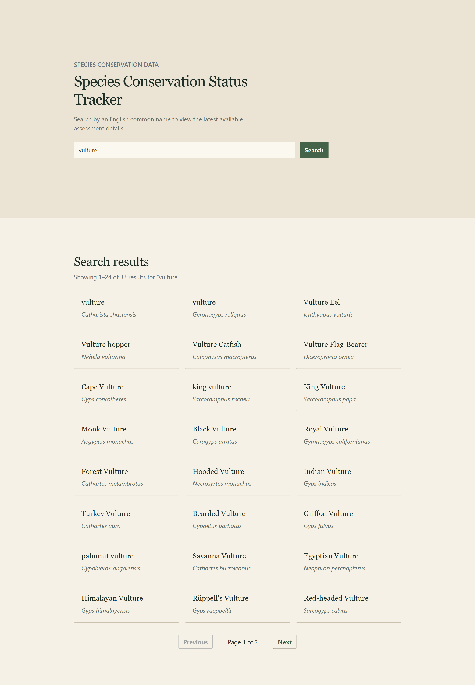
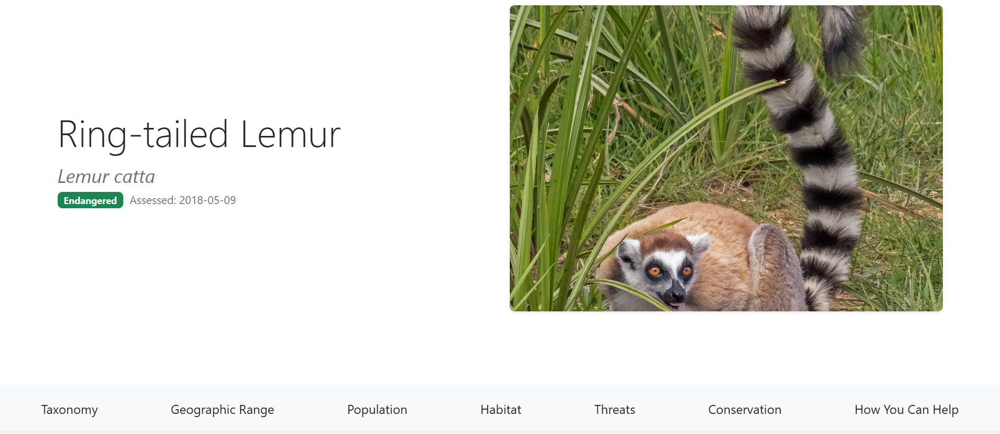
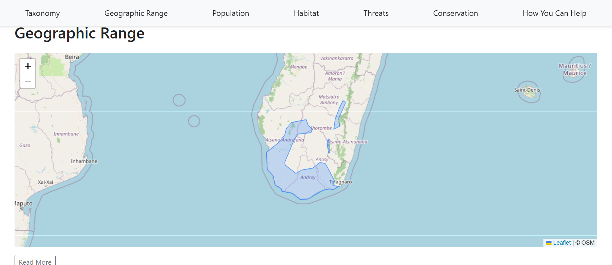
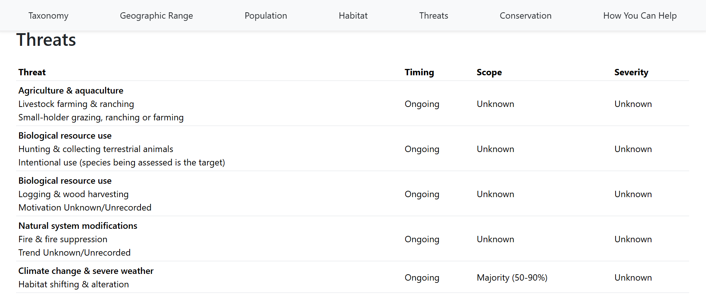
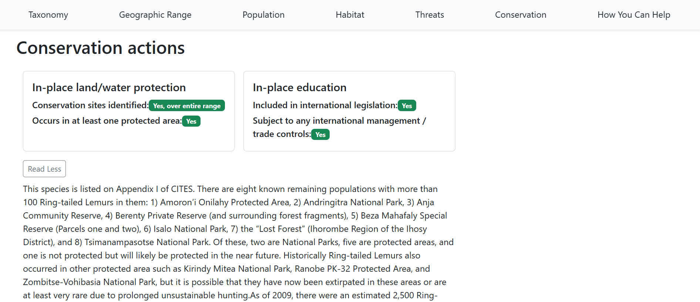

# React Species Tracker

## Overview

A full‑stack web application for exploring species conservation status, distribution ranges, and ecological information using IUCN Red List data and geospatial range datasets.

---

## Links / screenshots

- Repository: [GitHub repo](https://github.com/w-turney/species-tracker)

### Search page


### Species page - header


### Species page - range


### Species page - threats


### Species page - conservation


---

## Features

- Search for species by common name
- View the latest available IUCN Red List conservation assessment
- Interactive Leaflet map showing species distribution ranges where available
- PostGIS range data queries
- MongoDB caching layer to reduce repeated external API requests
- Defensive backend handling for missing, incomplete, or inconsistent external API data
- Responsive frontend built with React and Bootstrap

---

## Tech Stack

### Frontend
- React (Vite)
- Leaflet / React Leaflet
- Bootstrap

### Backend
- Node.js / Express
- PostgreSQL / PostGIS
- MongoDB / Mongoose

### GIS Tooling
- QGIS
- GDAL / ogr2ogr

### External APIs
- IUCN Red List API
- Global Biodiversity Information Facility (GBIF) API
- GlobalGiving API
- OpenStreetMap tiles

---

## Why I built the app

I built the app to strengthen my full-stack development skills while also exploring my passion for wildlife conservation.

The project gave me the opportunity to practise:

- Building a React frontend with reusable components and client-side routing
- Fetching, combining, and normalising data from external APIs
- Working with PostgreSQL, PostGIS, MongoDB, and Mongoose
- Processing geospatial range data using QGIS and GDAL
- Serving and displaying GeoJSON range data in Leaflet

---

## How it works

### Species search
- Users search for a species by common name
- The backend queries the GBIF API with the common name to return scientific names
- Search results link the user to a dedicated species page

### Displaying species conservation data
The species page combines data from several sources:

- IUCN Red List data for conservation status and assessment information
- PostGIS range data for species distribution maps
- GlobalGiving data for related conservation projects

The backend prepares and formats this data before returning it to the frontend

### Caching
- Species page data is cached in MongoDB to reduce repeated external API requests and improve performance for previously viewed species

---

## Architecture

React frontend → Express API → External APIs → PostGIS range database → MongoDB cache → React frontend

---

## API routes

- `GET /api/search` — search for species by common name
- `GET /api/species/:scientificName` — returns species page data

---

## Challenges / what I learned

- **Working with geospatial data**  
  One of the biggest challenges was learning how to work with species range shapefiles. I had to understand the different shapefile components, inspect the data in QGIS, filter the range data to relevant extant ranges, fix invalid geometries, dissolve multiple features per species, and import the cleaned data into PostGIS.

  This helped me understand how geospatial data moves through a full-stack application: from raw shapefiles, to database geometries, to GeoJSON API responses, to interactive map layers in Leaflet.

- **Dealing with external API data**  
  The external API responses were not always complete or consistent. I added defensive backend logic to handle missing fields, unexpected formats, unavailable assessments, and species with no local range data. This allowed the frontend to render useful fallback states instead of crashing.

- **Performance and data size**
  Range geometries can be large, so I used PostGIS indexes and refined range tables to make spatial lookups more efficient. I also added MongoDB caching to reduce repeated external API calls for species that had already been requested.

---

## Future improvements

- Add support for fish range data
- Improve the conservation project matching logic so suggested projects are more species-relevant
- Refine CSS / Bootstrap styling

---

## Local setup

### Prerequisites

- Node.js (LTS recommended)  
- PostgreSQL with PostGIS extension  
- MongoDB
- IUCN API token  
- GlobalGiving API token
- GDAL / ogr2ogr (e.g., via OSGeo4W on Windows)  


### Environment Variables

Create a `.env` file inside the `backend` directory:

```env
PORT=5000
IUCN_TOKEN=<YOUR_IUCN_API_TOKEN>
GLOBALGIVING_TOKEN=<YOUR_GLOBALGIVING_API_TOKEN>
DATABASE_URL=postgres://<USERNAME>:<PASSWORD>@localhost:5432/species_ranges
MONGO_URI=mongodb+srv://<USERNAME>:<PASSWORD>@<CLUSTER>.mongodb.net/species-tracker-react
```

---

### Clone the repository

```bash
git clone https://github.com/yourname/MyProject.git
cd MyProject
```

### Install dependencies

#### Frontend
```bash
cd frontend
npm install
```

#### Backend
```bash
cd ../backend
npm install
```

### PostGIS database setup

Inside your PostgreSQL database:
```sql
CREATE EXTENSION IF NOT EXISTS postgis;
```

### MongoDB database setup

MongoDB is used as a caching layer for species page data. Create a MongoDB database and add the connection string to `MONGO_URI` in the backend `.env` file.

---

### Optional: importing shapefile data

IUCN and BirdLife range shapefiles must be downloaded manually.  
Some taxa (e.g., mammals) are split into multiple shapefiles — import the first, then append the second.

Import into a `_raw` table first, then create a refined table for the application.

### Example: Mammals (two‑part import)

#### 1) Import part 1 (create/overwrite)
```bash
ogr2ogr -progress -f "PostgreSQL" \
  PG:"host=localhost port=5432 dbname=<db_name> user=<user> password=<password>" \
  "path/to/mammals_part1.shp" \
  -nln mammals_raw \
  -lco GEOMETRY_NAME=geom \
  -nlt PROMOTE_TO_MULTI \
  -overwrite
```

#### 2) Import part 2 (append)
```bash
ogr2ogr -progress -f "PostgreSQL" \
  PG:"host=localhost port=5432 dbname=<db_name> user=<user> password=<password>" \
  "path/to/mammals_part2.shp" \
  -nln mammals_raw \
  -lco GEOMETRY_NAME=geom \
  -nlt PROMOTE_TO_MULTI \
  -update -append
```

---

#### Refining Tables (filter, dissolve, validate)

This example creates a simplified `mammals` table from `mammals_raw` by:

- Filtering to extant ranges  
- Dissolving geometries by `id_no`  
- Fixing invalid geometries  
- Ensuring multipolygon output  

```sql
DROP TABLE IF EXISTS public.mammals;

CREATE TABLE public.mammals AS
SELECT
  id_no,
  MIN(sci_name) AS sci_name,
  ST_Multi(
    ST_Union(
      CASE
        WHEN ST_IsValid(geom) THEN geom
        ELSE ST_MakeValid(geom)
      END
    )
  ) AS geom
FROM public.mammals_raw
WHERE legend ILIKE '%extant%'
GROUP BY id_no;

ALTER TABLE public.mammals
ADD COLUMN geom_simpl_5km geometry;

UPDATE public.mammals
SET geom_simpl_5km = ST_SimplifyPreserveTopology(geom, 0.05);
```

Recommended Indexes:

```sql
CREATE INDEX IF NOT EXISTS mammals_id_no_idx ON public.mammals (id_no);
CREATE INDEX IF NOT EXISTS mammals_geom_gix ON public.mammals USING GIST (geom);
CREATE INDEX IF NOT EXISTS mammals_geom_simpl_5km_gix ON public.mammals USING GIST (geom_simpl_5km);
```

---

## Running the App

### Backend

From the project root, start the backend:

```bash
cd backend
npm run dev
```

### Frontend

In a separate terminal, from the project root, start the frontend:

```bash
cd frontend
npm run dev
```

---

## Credits / data sources

- IUCN Red List API
- IUCN / BirdLife species range shapefiles
- GBIF API
- GlobalGiving API
- OpenStreetMap